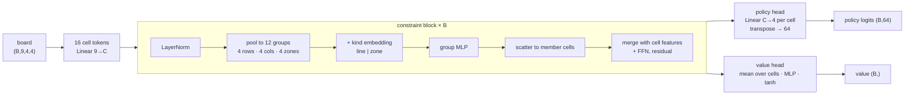

# quantik-models

[](https://pypi.org/project/quantik-models/)
[](https://pypi.org/project/quantik-models/)
[](LICENSE)

Policy/value networks for **Quantik**, and the training, evaluation and play
tooling behind them. Four architectures, parameter-matched, trained on
positions labelled by an exact solver — and four sets of weights published on
the Hugging Face Hub.

Quantik is a 4×4 board game with a group-wise placement rule: you may not
place a shape in a row, column or 2×2 zone where your *opponent* already has
that shape, and you win by completing a line of four different shapes in
either colour. It is small enough to solve exactly, which is what makes it a
useful place to ask whether an architectural prior is worth having — the
ground truth is available to check the answer against.

```bash
pip install 'quantik-models[torch,hub]'
```

```python
from quantik_models import hub
from quantik_models.env import fastboard as fb

evaluator = hub.load_evaluator("cpool")     # downloads and verifies the weights

boards = fb.empty_boards(1)                 # (1, 8) uint16
policy, value = evaluator.evaluate(boards)  # (1, 64) logits, (1,) value
```

Working *on* this package rather than with it: **[DEVELOPMENT.md](DEVELOPMENT.md)**.

## Install

| you want | install |
|---|---|
| the published models, on torch | `pip install 'quantik-models[torch,hub]'` |
| the published models, no torch | `pip install 'quantik-models[serve,hub]'` |
| to train your own | `pip install 'quantik-models[torch,onnx]'` |
| the library only | `pip install quantik-models` |

The base install is `numpy` and `quantik-core` and nothing else. torch is a
529 MB dependency and onnxruntime is 80 MB; neither is imposed on someone who
does not need it. The full table is in
[DEVELOPMENT.md](DEVELOPMENT.md#environment).

Python 3.12+.

## The models

Four networks answering the same question in different ways, all
interchangeable because they agree on one contract:

    input   (B, 9, 4, 4) float32      tensor-board.v1, mover-relative
    output  (B, 64) policy logits     action_index = shape * 16 + position
            (B,)    value in [-1, 1]  +1 = good for the side to move

**Legality masking is applied outside every model**, using the same code path
in training and at inference — so no engine here can return an illegal move.

| model | Hub repository | IID top-1 | vs `minimax-d2` |
|---|---|---|---|
| **`cpool`** | [`quantik-cpool-c191-b6`](https://huggingface.co/brpoplpush/quantik-cpool-c191-b6) | **0.9893** | **49.4%** |
| `attn` | [`quantik-attn-d192-b6`](https://huggingface.co/brpoplpush/quantik-attn-d192-b6) | 0.9879 | 43.1% |
| `resnet` | [`quantik-resnet-c128-b6`](https://huggingface.co/brpoplpush/quantik-resnet-c128-b6) | 0.9701 | 36.5% |
| `mlp` | [`quantik-mlp-h455-b4`](https://huggingface.co/brpoplpush/quantik-mlp-h455-b4) | 0.9516 | 31.9% |

`minimax-d2` is a fixed two-ply alpha-beta search — the only opponent whose
strength does not move with the field, and so the only column that answers
"is any of this good" rather than "which of these is better". `cpool` playing
raw policy, one forward pass per move, is even with it. **Full numbers, the
four measurements that disagree, and what not to conclude from them:
[`docs/models.md`](docs/models.md).**

> **The weights are CC BY-NC 4.0; this package is MIT.** A commercial
> application may use the pipeline, the rules engine and the evaluation
> harness freely, and may not ship these weights. Train your own and they
> are yours.

### `cpool` — the constraint model

Quantik's rule is group-wise, not spatial: twelve overlapping groups (4 rows,
4 columns, 4 zones), every cell in exactly three. Each block pools the sixteen
cell tokens into those groups, transforms them there, and scatters back.



[`docs/architecture-constraint-pool.md`](docs/architecture-constraint-pool.md)

### `attn` — the same bet without the prior

Transformer encoder over the sixteen cells, told *nothing* about rows,
columns or zones. It is the test of whether `cpool`'s explicit wiring was
necessary: on policy accuracy it ties, on the value head it does not.

[`docs/architectures.md`](docs/architectures.md) ·
[`docs/attention-negative-result.md`](docs/attention-negative-result.md)

### `resnet` — the incumbent

Convolutional residual trunk, and the architecture every hyperparameter here
was originally chosen for. 99.2% of its parameters are the trunk.

[`docs/architecture-resnet.md`](docs/architecture-resnet.md)

### `mlp` — the control

Throws spatial structure away entirely: 144 flat features through dense
residual blocks. It exists to make "convolution is worth having on a 4×4
board" falsifiable rather than assumed. It loses, so the spatial prior is
real.

[`docs/architecture-mlp.md`](docs/architecture-mlp.md)


The dashed lines are two architectures trained at `2e-3`, the rate the ResNet
was tuned for and everything added later inherited by silence. `attn` did not
learn at all at that rate; `cpool` converged perfectly well, to a lower place.
A single-rate comparison cannot tell either of those apart from "this
architecture is worse" — which is how three published conclusions here turned
out to be hyperparameter artifacts.
[`docs/learning-rate-sweep.md`](docs/learning-rate-sweep.md).

## Playing against them

The play service serves the board and the models on one port, and records
finished games:

```bash
pip install 'quantik-models[serve,hub]'
quantik-models-play --models staging
```

It prints a LAN address to open on a phone. `--no-store` opens no database,
which is the configuration the public container runs.
[`docs/play-service.md`](docs/play-service.md).

## Training your own

```bash
pip install 'quantik-models[torch,onnx]'
```

```bash
# check the assumptions before a long run (~1 min/arch)
python -m quantik_models.train.preflight --preset medium --epochs 16

# train to convergence: --epochs is the cap, --patience the rule
python -m quantik_models.train.supervised --arch cpool --preset medium \
  --corpus runs/oracle/corpus/exact-sampled.npz --name my-run \
  --epochs 60 --patience 5

# regenerate every published number for it
scripts/evaluate_lineup.sh runs/eval/today cpool=runs/train/my-run/best

# stage it as a Hugging Face model repository (writes files; uploads nothing)
quantik-models-hf-stage runs/train/my-run/best staging/my-model
```

Training writes `weights.safetensors`, `model.onnx`, a
`model-checkpoint.v1` `manifest.json` and a training report. Corpora, the
label strategy and the retrain/fine-tune path — including freezing part of a
network — are in [`docs/`](docs/README.md).

## Documentation

[`docs/README.md`](docs/README.md) is the reading order. The four to start
with:

| | |
|---|---|
| [`docs/models.md`](docs/models.md) | the published models: how to load one, what the numbers mean, what not to conclude |
| [`docs/decisions/0001-architecture-lineup.md`](docs/decisions/0001-architecture-lineup.md) | which architectures were trained, which six were declined, and the methodology |
| [`docs/benchmarks.md`](docs/benchmarks.md) | the figures, and what each does and does not establish |
| [`docs/oracle-benchmark.md`](docs/oracle-benchmark.md) | the field against a fixed classical engine |

## Related

- [`quantik-core`](https://pypi.org/project/quantik-core/) — the rules
  engine, QFEN, bitboards and the exact solver. Also on
  [crates.io](https://crates.io/crates/quantik-core).
- [The models on the Hub](https://huggingface.co/brpoplpush) — weights,
  ONNX graphs and model cards.

## License

MIT — see [LICENSE](LICENSE). The published **weights** are CC BY-NC 4.0 and
are not distributed with this package.
