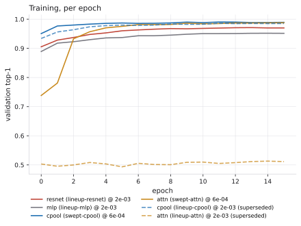
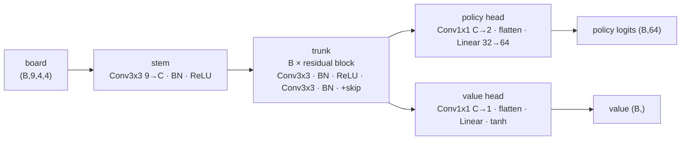
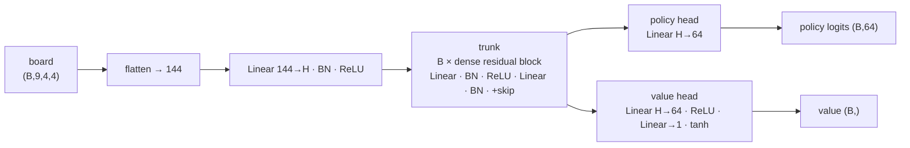
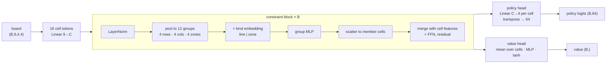
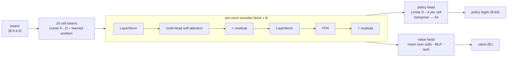

# quantik-models-py

`quantik-models-py` owns Quantik model training, dataset materialization,
autoplay experiments, checkpoint export, and evaluation. It consumes
`quantik-core-py`, `quantik-core-rust`, and `quantik-core-contracts`; it does
not replace them.

Core libraries stay small and stable:

- `quantik-core-contracts`: artifact IDs, schemas, docs, validators.
- `quantik-core-rust`: search, opening-book generation, observations, H2H,
  self-play producers.
- `quantik-core-py`: artifact readers, QFEN/bitboard/action helpers, tensor
  encoders, checkpoint manifest validation.
- `quantik-models-py`: training views, model architecture, training loops,
  exported checkpoints, calibration reports.

## Clone The Workspace

Choose any parent directory for the Quantik repositories:

```bash
export QUANTIK_NS="$HOME/Code/quantik-ns"
mkdir -p "$QUANTIK_NS"
cd "$QUANTIK_NS"

git clone https://github.com/mberlanda/quantik-core-contracts.git
git clone https://github.com/mberlanda/quantik-core-rust.git
git clone https://github.com/mberlanda/quantik-core-py.git
git clone https://github.com/mberlanda/quantik-models-py.git
```

## Setup

```bash
export QUANTIK_NS="${QUANTIK_NS:-$HOME/Code/quantik-ns}"
export CONTRACTS="$QUANTIK_NS/quantik-core-contracts"
export RUST="$QUANTIK_NS/quantik-core-rust"
export CORE_PY="$QUANTIK_NS/quantik-core-py"
export MODELS="$QUANTIK_NS/quantik-models-py"

cd "$MODELS"
test -d .venv || python -m venv .venv
.venv/bin/python -m pip install -e "${CORE_PY}[arrow]"
.venv/bin/python -m pip install -e ".[dev,arrow]"
```

## Smoke Pipeline

```bash
cd "$MODELS"
scripts/run_smoke_pipeline.sh
```

The script validates contracts, asks Rust to build a depth-6 opening book,
generates positions, observations, H2H rows, and MCTS self-play rows, converts
contract rows to Parquet where supported, and materializes `.npz` training
views.

## CI Data Pipeline

`.github/workflows/e2e-data-pipeline.yml` runs a tiny version of the same flow
on GitHub Actions. It checks out contracts, Rust core, Python core, and this
repository; generates a small book/dataset/observation/H2H/self-play corpus;
materializes training views; verifies the output arrays; and uploads the smoke
artifacts.

## Materialize A Training View

From observations:

```bash
quantik-models-materialize \
  --observations-jsonl /path/to/observations-v1.jsonl \
  --output-npz /path/to/training-view-observations.npz
```

From self-play:

```bash
quantik-models-materialize \
  --selfplay-jsonl /path/to/selfplay-v1.jsonl \
  --output-npz /path/to/training-view-selfplay.npz
```

## Models

Four architectures, all answering the same question in a different way and
all interchangeable because they agree on one contract:

    input   (B, 9, 4, 4) float32      tensor-board.v1, mover-relative
    output  (B, 64) policy logits     action_index = shape * 16 + position
            (B,)    value in [-1, 1]  +1 = good for the side to move

Legality masking is applied **outside** every model, by `masked_log_softmax`,
using the same code path in training and at inference — so no engine here can
return an illegal move.

> **Current results, 2026-08-30.** `--preset medium`, ~1.79M parameters each,
> matched within 1.2%. `cpool` and `attn` at `--lr 6e-4`; `resnet` and `mlp`
> at `2e-3`. Those rates are swept, not inherited — see
> [`docs/learning-rate-sweep.md`](docs/learning-rate-sweep.md).
>
> | model | IID top-1 | shift, plies 4-6 | shift, plies 7-12 | arena @ply3 | vs `minimax-d2` |
> |---|---|---|---|---|---|
> | `cpool-c191-b6` | **0.9893** | **0.9295** | **0.9919** | **57.2%** | **49.4%** |
> | `attn-d192-b6` | 0.9879 | 0.9102 | 0.9914 | 54.2% | 43.1% |
> | `resnet-c128-b6` | 0.9701 | 0.9126 | 0.9720 | 47.8% | 36.5% |
> | `mlp-h455-b4` | 0.9516 | 0.8843 | 0.9578 | 40.8% | 31.9% |
>
> Four numbers, because they disagree: validation on the trained
> distribution, accuracy on solved positions the corpus never saw
> ([`docs/shift-evaluation.md`](docs/shift-evaluation.md)), games against the
> other networks ([`docs/autoplay.md`](docs/autoplay.md)), and games against a
> fixed classical opponent
> ([`docs/oracle-benchmark.md`](docs/oracle-benchmark.md)) — the only column
> whose floor does not move with the field. `cpool` playing raw policy, one
> forward pass a move, is even with a two-ply alpha-beta search; the other
> three lose to it. Which architectures were declined
> and why is in
> [`docs/decisions/0001-architecture-lineup.md`](docs/decisions/0001-architecture-lineup.md).



The dashed lines are the same two architectures trained at `2e-3`, the rate
the ResNet was tuned for and everything added later inherited. `attn` did
not learn at all at that rate; `cpool` converged perfectly well, to a lower
place. A single-rate run cannot tell either of those apart from "this
architecture is worse". Every figure, and what each one does and does not
establish: [`docs/benchmarks.md`](docs/benchmarks.md).

### `resnet` — the incumbent

Convolutional residual trunk. 99.2% of its parameters are the trunk; both
heads together are 3,655.



Design: [`docs/architecture-resnet.md`](docs/architecture-resnet.md) ·
Training: [`docs/policy-value-training-paper.md`](docs/policy-value-training-paper.md)

### `mlp` — the control

Throws spatial structure away entirely: 144 flat features through dense
residual blocks. It exists to make "convolution is worth having on a 4x4
board" falsifiable rather than assumed. It loses, so the spatial prior is
real.



Design: [`docs/architecture-mlp.md`](docs/architecture-mlp.md)

### `cpool` — the constraint model

Quantik's rule is group-wise, not spatial: a shape may not go where the
opponent already has that shape in the same row, column or 2x2 zone. Twelve
overlapping groups, every cell in exactly three. Each block pools the sixteen
cell tokens into those groups, transforms them there, and scatters back.



Design: [`docs/architecture-constraint-pool.md`](docs/architecture-constraint-pool.md)

### `attn` — the same bet without the prior

Transformer encoder over the sixteen cells. It is told *nothing* about rows,
columns or zones and has to discover them, which is what makes it the test of
whether `cpool`'s explicit wiring was necessary. On policy accuracy it ties;
on the value head it does not.



Design: [`docs/architectures.md`](docs/architectures.md) ·
Why it first appeared to fail:
[`docs/attention-negative-result.md`](docs/attention-negative-result.md)

### Working with them

    # what is registered, and at what rate
    python -c "from quantik_models.model import registry; \
      print([(a, registry.default_lr(a)) for a in registry.architectures()])"

    # check the assumptions before a long run (~1 min/arch)
    python -m quantik_models.train.preflight --preset medium --epochs 16

    # train to a fixed budget, as every published run did
    python -m quantik_models.train.supervised --arch cpool --preset medium \
      --corpus runs/oracle/corpus/exact-sampled.npz --name my-run --epochs 16

    # or train to convergence: --epochs becomes a cap, --patience the rule
    python -m quantik_models.train.supervised --arch attn --preset medium \
      --corpus runs/oracle/corpus/exact-sampled.npz --name my-run \
      --epochs 60 --patience 5

    # regenerate every published number
    scripts/evaluate_lineup.sh runs/eval/today cpool=runs/train/my-run/best

    # stage the family for the Hugging Face Hub (writes files; uploads nothing)
    scripts/stage_hub_repos.sh staging \
      runs/train/swept-cpool/best runs/train/swept-attn/best \
      runs/train/lineup-resnet/best runs/train/lineup-mlp/best

Retraining and fine-tuning, including freezing part of a network:
[`docs/retrain-and-finetune.md`](docs/retrain-and-finetune.md). What a model
repository needs, and what the Hub treats as structural rather than
decorative: [`docs/publishing-to-hugging-face.md`](docs/publishing-to-hugging-face.md).

## Training and checkpoint export

Install the training extra and train the smoke preset on materialized
views:

    pip install -e ".[dev,torch]"
    quantik-models-train \
      --npz outputs/smoke/training-view-observations.npz \
      --npz outputs/smoke/training-view-selfplay.npz \
      --preset smoke --epochs 5 --out-dir outputs/checkpoint

This exports `weights.safetensors`, `training-report.json`, and a
`model-checkpoint.v1` `manifest.json` (validated against
quantik-core-py in tests). See `examples/train_smoke.sh` for the full
end-to-end demo, `examples/inspect_checkpoint.py` to poke at a
checkpoint, and `docs/scaling-guide.md` for the smoke -> small ->
target path. The design/tradeoff discussion lives in
`docs/policy-value-training-paper.md`.

See `docs/architectures.md` for the model contract, the architecture
registry, and how checkpoints are exported (safetensors plus ONNX).

See `docs/model-report.md`, `docs/pipeline.md`, `docs/tensor-structure.md`,
`docs/labeling-strategy.md`, `docs/autoplay-training.md`, and
`docs/frontend-play.md`.
