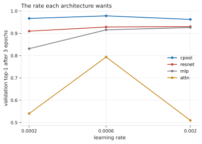
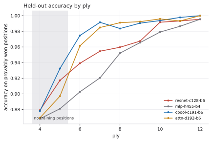
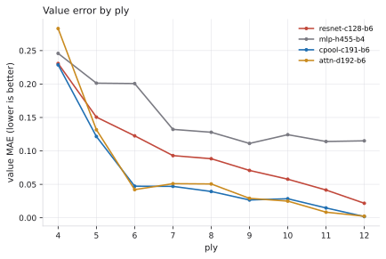
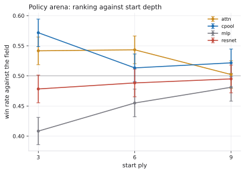
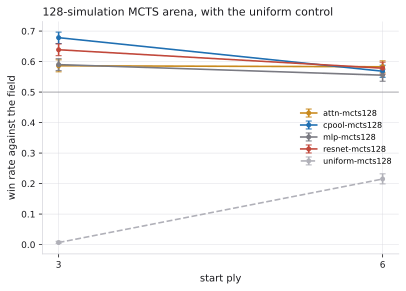

# Benchmarks: every run, in pictures

> **About the numbers in this document.** Every measurement here comes from
> a specific run of a specific checkpoint, and the checkpoints live under
> `runs/`, which is gitignored — so nothing here can be verified from a
> fresh clone alone. Two things are worth checking before trusting a figure:
> **which learning rate it was measured at**, and **when**. Anything dated
> before 2026-08-30 was measured at `--lr 2e-3`, a rate chosen for the
> ResNet and inherited by every architecture added later; two of the four
> were being trained at the wrong one, and correcting that reversed several
> conclusions rather than merely shifting decimals. See
> `learning-rate-sweep.md`. Regenerate everything with
> `scripts/evaluate_lineup.sh`.

This document introduces no number that is not already in
`architectures.md`, `shift-evaluation.md`, `autoplay.md` or
`learning-rate-sweep.md`. It exists because four of the findings are shapes
rather than values, and a table is a bad way to show a shape: a curve that
is flat for sixteen epochs, an optimum that is a peak rather than a trend, a
crossover, a ranking that moves.

The figures are committed SVGs. `runs/` is gitignored, so this is the only
form in which a reader of a fresh clone sees any of it. They are regenerated
from the run directories, never edited:

```bash
pip install -e '.[viz]'
python -m quantik_models.report.build_figures --runs runs --out docs/figures
```

## How training went


Solid lines are the four checkpoints the comparison uses. Dashed lines are
the same architecture trained at the ResNet's 2e-3 and superseded.

The amber dashed line is the whole methodological finding in one shape.
`attn-d192-b6` at 2e-3 sits at 0.51 for sixteen epochs and 45,808 steps —
not a weaker model, a model that does not learn — and the solid amber line
is the same architecture, same corpus, same budget, at 6e-4. It was one
commit away from being written up as a failed architecture.

The blue pair is the quieter version of the same problem: `cpool` at 2e-3
converges perfectly well, just to a lower place, and nothing about the
dashed curve looks wrong on its own. A single-rate run cannot tell "this
architecture is worse" from "this rate is worse for this architecture" —
only the pair can.

| run | rate | epochs | best val top-1 | final value MAE | wall clock |
|---|---|---|---|---|---|
| `swept-cpool` | 6e-4 | 16 | **0.9905** | **0.0315** | 57.6 min |
| `swept-attn` | 6e-4 | 16 | 0.9879 | 0.0375 | 96.9 min |
| `lineup-resnet` | 2e-3 | 16 | 0.9712 | 0.0710 | 29.0 min |
| `lineup-mlp` | 2e-3 | 16 | 0.9519 | 0.1116 | 6.8 min |
| `lineup-cpool` *superseded* | 2e-3 | 16 | 0.9861 | 0.0435 | 52.5 min |
| `lineup-attn` *superseded* | 2e-3 | 16 | 0.5130 | 0.6488 | 84.8 min |

Wall clock is one machine, and the runs were not isolated from each other,
so it is not a benchmark of anything. It is here because the ratios are
large enough to survive that noise: at matched parameter count the attention
network costs about **14x** the MLP and **3x** the ResNet for the same
sixteen epochs. That is what makes a convergence-based budget expensive
rather than free — the architecture that most needs the extra epochs is also
the one they cost the most on.

## The rate each architecture wants



Four architectures, three rates, three epochs, one shared protocol. The
shape is the result:

- `mlp` and `resnet` are **monotone** over the range — the incumbent 2e-3 is
  at or near their best, so their published numbers stand.
- `cpool` and `attn` are **inverted U**s with the peak at 6e-4. An inverted
  U is what a wrong rate looks like from the outside; a monotone curve is
  what "the grid does not reach far enough" looks like.

The peak sits in the middle of the grid for both, so 6e-4 is *better than
2e-3*, not *optimal*. A finer grid would find something better. What this
sweep establishes is only that 2e-3 was wrong for two of the four.

## Held-out accuracy, by ply



7,800 exactly solved positions sharing no canonical key with the training
corpus. The shaded band is plies 4-5, where the corpus holds **nothing** —
that band is the only part of the figure measuring generalisation rather
than recall, and it is where the four models are closest together.

The lines converge to the right because deep positions are nearly forced.
By ply 12 both `cpool` and `attn` are perfect and the interesting question
has moved entirely into the shallow end.



The value head is where the constraint prior earns its keep, and the gap is
widest exactly where the policy gap is narrowest. `cpool` holds 0.0777 MAE
against `attn`'s 0.0881 across the probe — a smaller difference than the
policy tables suggest matters, and the next figure is why it does.

## The arena



3,600 games per depth, every ordered pairing, seed 20260830 — deliberately
not a training seed. Whiskers are 95% Wilson intervals.

Two things are visible that the table hides. The **spread collapses with
depth**: at ply 3 the field runs from 40.8% to 57.2%, at ply 9 from 48.1%
to 52.2%. And the ResNet is third at every depth *on raw policy*, with its
interval overlapping the 50% line at plies 6 and 9 — it is not in the
argument between `cpool` and `attn`.



6,000 games per depth at 128 simulations, with the uniform-prior control
drawn dashed and grey.

The control is the reason this figure exists. At ply 3 it wins **0.7%** of
its games, so the networks are doing essentially all of the work; at ply 6
it wins 21.5%, because six plies in, the game is forced enough that search
alone finds a lot of it. Any claim of the form "the network contributes X"
has to be read against that line, not against the other networks.

And the finding the policy figure cannot show: **search reorders the
field.** `attn` is second on raw policy at ply 3 and *last among the
networks* under search, below even the MLP. The ResNet, third on policy, is
second under search at both depths. Search leans on the leaf value, and the
value MAE figure above is where that ordering comes from.

## What these figures do not show

**One seed per architecture.** Every training curve is a single run. The
arena seed is separate and varied; the training seed is not.

**A fixed sixteen-epoch budget.** The amber solid line is still climbing
when it stops. `attn`'s 0.9879 is a floor, and a shared epoch budget is not
equal treatment for the same reason a shared learning rate was not — it was
chosen when the ResNet was the only architecture. This is unfixed.

**No classical baseline.** Every win rate on this page is against another
network or against the uniform control. Nothing here says these models beat
`quantik-core`'s own minimax or beam search — a different and harder
question, and still unmeasured.

**Nothing trained on `exact-sampled-v2.npz`.** The corpus with plies 3-6
filled exists and no figure on this page uses it. Training on it would
measure a better corpus, not a better architecture.
