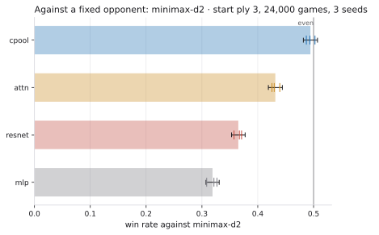

# The oracle benchmark: how good is any of this?

> **About the numbers in this document.** Every measurement here comes from
> a specific run of a specific checkpoint, and the checkpoints live under
> `runs/`, which is gitignored — so nothing here can be verified from a
> fresh clone alone. Two things are worth checking before trusting a figure:
> **which learning rate it was measured at**, and **when**. Anything dated
> before 2026-08-30 was measured at `--lr 2e-3`, a rate chosen for the
> ResNet and inherited by every architecture added later; two of the four
> were being trained at the wrong one, and correcting that reversed several
> conclusions rather than merely shifting decimals. See
> `learning-rate-sweep.md`. Regenerate everything with
> `scripts/evaluate_lineup.sh`.

Every win rate this project had published until now was measured against
another one of its own networks, or against `uniform-mcts` — a control whose
evaluator returns zero everywhere. Those answer *which of these is better*.
They cannot answer *is any of them good*, because the floor moves with the
field: a lineup of four bad models still produces a leader at 57%.

This is the fixed opponent. `quantik-core`'s alpha-beta minimax at a fixed
depth is exactly the same player in every run, on every seed, forever.

## Choosing the depth, before spending the budget

The depth was measured rather than assumed, because an earlier note in this
project put `minimax-d2` at 1.1 s a move and `minimax-d4` at 57 s — figures
taken while a twelve-run sweep and an exact solver were saturating the
machine. Re-timed on a quiet one, median seconds per move:

| start ply | `minimax-d2` | `minimax-d4` |
|---|---|---|
| 0 | 0.025 | 3.98 |
| 1 | 0.152 | 24.3 |
| 2 | 0.279 | — |
| 3 | 0.156 | 16.4 |
| 6 | 0.045 | 0.64 |

`d2` never exceeds 0.28 s anywhere, so the old 1.1 s was contention rather
than a shallower start. **A timing taken under load is an upper bound**, and
the difference here is between "not something to start alongside other work"
and one hour.

At 0.156 s a move and roughly five oracle moves per game from a ply-3 start,
1,000 games per ordered pairing costs about 17 minutes — eight pairings, an
afternoon. `d4` at 16.4 s is three orders of magnitude off that.

### The fixed-clock configuration is not usable as an oracle

The obvious alternative is a time budget rather than a depth, since that is
what `fixed_time_baselines` offers. It does not work here:

| configuration | measured, ply 3 | measured, ply 6 |
|---|---|---|
| `minimax@10ms` | 0.157 s | 0.045 s |
| `minimax@50ms` | 0.158 s | 0.178 s |
| `minimax@100ms` | 0.157 s | 0.244 s |

At a ply-3 start all three spend the same 157 ms and reach the same depth as
`-d2`. Iterative deepening cannot interrupt a level, so the clock only binds
once a level costs more than the budget — and the first level already costs
more than 100 ms there. **A budget the engine ignores is not a budget**, and
an opponent whose strength depends on the machine it ran on is not an
oracle. Fixed depth is.

## Method

Four networks against `minimax-d2`, both seats, every game recorded.

- **1,000 games per ordered pairing**, eight pairings per run: each network
  moves first 1,000 times and second 1,000 times.
- **Seeds 20260902, 20260903 and 20260904** at start ply 3, plus 20260902 at
  start ply 6. None is a training seed — training used 20260827, 20260828
  and 20260901 — so a seed-linked bias shows rather than hides.
- **`--against minimax-d2`** restricts the schedule to pairings involving
  the oracle. Twelve of the twenty ordered pairings in a full round robin
  are network-versus-network and already measured; running them again would
  spend most of the budget on nothing.

```bash
scripts/oracle_benchmark.sh runs/eval/oracle-2026-08-29 \
  cpool=runs/train/swept-cpool/best attn=runs/train/swept-attn/best \
  resnet=runs/train/lineup-resnet/best mlp=runs/train/lineup-mlp/best
```

### Not subagents

The request was to dispatch subagents. What each run needs is one
`python -m quantik_models.arena.autoplay` invocation, so a subagent per run
would have started cold to issue a shell command. The four runs went in
parallel as background processes instead: the parallelism is there, the
cold starts are not. Recorded rather than substituted silently.

## The seat is not a detail

From a ply-3 start the player to move wins most games no matter who it is.
A single pooled win rate against a fixed opponent therefore mixes the
network's strength with the first-move advantage, and the two have to be
separated before the number means anything. `arena.pack` splits them.

## The result



Bars are the pooled rate over three seeds; the whiskers are the 95% Wilson
interval and the ticks are the individual seeds.

**Start ply 3 — 24,000 games, seeds 20260902/03/04:**

| model | vs `minimax-d2` | 95% CI | as mover | as responder | verdict |
|---|---|---|---|---|---|
| `cpool-c191-b6` | **49.4%** | 48.2–50.7 | 60.6% | 38.2% | **indistinguishable** |
| `attn-d192-b6` | 43.1% | 41.9–44.4 | 51.2% | 35.1% | loses |
| `resnet-c128-b6` | 36.5% | 35.3–37.7 | 47.1% | 25.9% | loses |
| `mlp-h455-b4` | 31.9% | 30.7–33.1 | 41.2% | 22.6% | loses |

**Start ply 6 — 8,000 games, seed 20260902:**

| model | vs `minimax-d2` | 95% CI | as mover | as responder | verdict |
|---|---|---|---|---|---|
| `attn-d192-b6` | 49.7% | 47.5–51.9 | 77.3% | 22.1% | indistinguishable |
| `cpool-c191-b6` | 48.9% | 46.7–51.0 | 77.2% | 20.5% | indistinguishable |
| `resnet-c128-b6` | 43.9% | 41.7–46.0 | 70.5% | 17.2% | loses |
| `mlp-h455-b4` | 40.8% | 38.7–43.0 | 66.5% | 15.1% | loses |

"Indistinguishable" is a result here, not a missing one: the interval
straddles even, so the claim being refused is *both* "this network beats
depth-2 minimax" and "depth-2 minimax beats it".

## What it says

**One raw network matches a two-ply search, and only one.** `cpool` playing
its policy argmax — no search, one forward pass a move — is even with
`minimax-d2` at both start depths. `attn` manages it at ply 6 and not at
ply 3. The ResNet and the MLP lose everywhere, and by margins far outside
their intervals.

**The internal ranking survives contact with an outside opponent.** The
order against minimax at ply 3 — `cpool`, `attn`, `resnet`, `mlp` — is
exactly the order of the network-versus-network policy arena at ply 3. That
was not guaranteed. A ranking measured only within a field can be an
artifact of the field, and this is the first evidence here that it is not.

**The margins are much wider against a fixed opponent.** In the internal
arena at ply 3 the field ran from 40.8% to 57.2%; against minimax it runs
from 31.9% to 49.4%. Same ordering, but the internal figures are compressed
by every model beating and losing to the same peers. A 16-point internal
spread was hiding a 17-point spread measured against something that does
not move.

**Three fresh seeds found no seed-linked bias.** The widest gap between two
ply-3 seeds is **1.5 points** for `cpool` and at most 1.9 for any model,
against intervals about 1.2 points wide. That is the negative result the
seeds were chosen to look for, and it is worth having: it says the ply-3
numbers here are about the models, not about which openings the RNG picked.

## What it does not say

**`minimax-d2` is not strong play.** It is a two-ply alpha-beta search — a
fixed, reproducible opponent, chosen because it is affordable and identical
in every run, not because it is a ceiling. "Even with `minimax-d2`" is a
floor being cleared, not a summit. Depth 4 costs 16.4 s a move and remains
unmeasured.

**The seat effect is larger than every model difference, and it grows with
depth.** At ply 3, `cpool` wins 60.6% as mover and 38.2% as responder — a
22-point swing. At ply 6 the same model swings 77.2% to 20.5%, 57 points.
Six plies in there is simply less game left in which to recover from moving
second. Any single number that does not hold the seat fixed is measuring
mostly this.

**The ply-6 row is one seed.** The three-seed replication is at ply 3 only.

**No beam-search baseline.** `beam-w64` was measured at 73 s a move under the
same contention that made `minimax-d2` look ten times slower than it is, so
that number means very little and the run has not been costed properly.

## What comes out of it, besides the numbers

The four runs visited **26,157 distinct positions at plies ≤ 6 that the
training corpus does not contain**, deduplicated up to the 192 symmetries.
Games against a different kind of opponent go to different places than
self-play does, which is the second reason to run this.

`arena.pack` writes them gzipped and ready for the exact solver:

```
runs/eval/oracle-2026-08-29/packed/
  to-solve.qfen.gz          26,157 positions, symmetry-deduplicated
  games-*.json.gz           every game, ~25x smaller than the raw JSON
  summary.json  summary.md  pooled, per-seed, and head-to-head by seat
```

Solving them and folding the labels into the corpus is the next step, and a
large one: the previous batch of 5,226 positions took 6h50m and yielded
118,053 labelled rows once children were counted. This batch is five times
larger.
